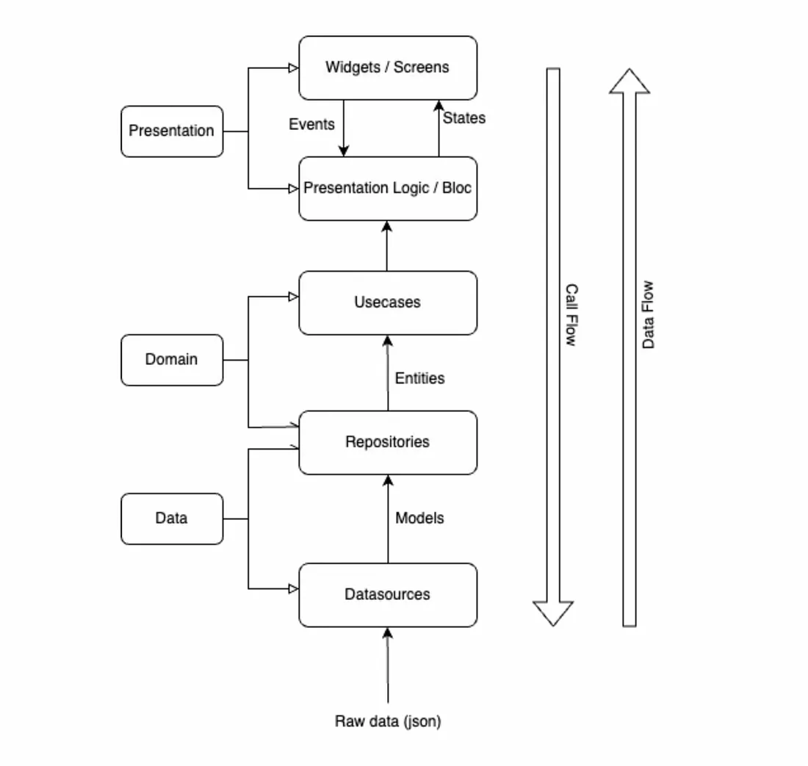
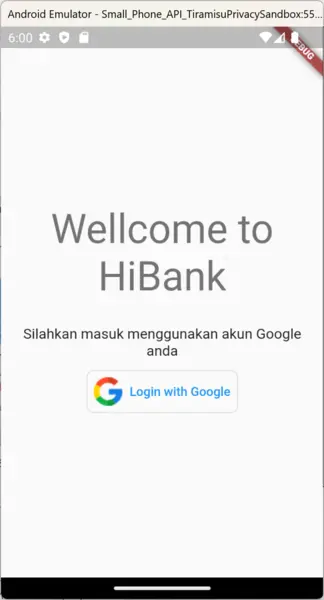
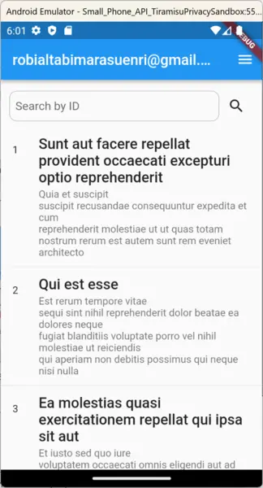
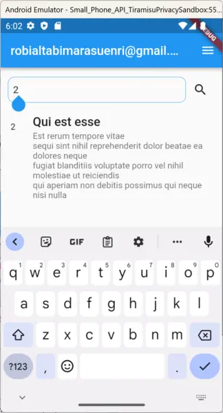
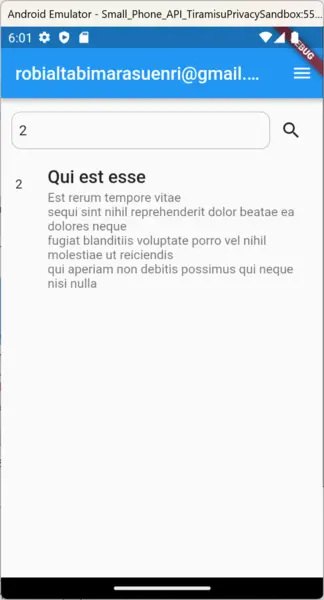
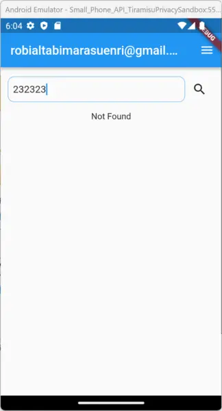
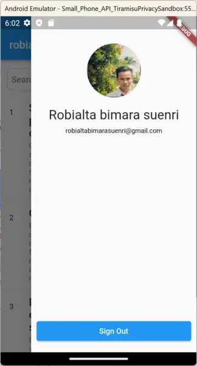

### Architecture

This Application using Clean Architecture MVVM using BLoC state management referenced https://medium.com/@enesakbal00/flutter-clean-architecture-part-1-introduction-f5dadf1bf3ee

### Authentication

Using Firebase Authentication connected to my firebase account with Single Sign On Google
Dependency package:

- Firebase Core https://pub.dev/packages/firebase_core
- Firebase Auth https://pub.dev/packages/firebase_auth
- Google Sign In https://pub.dev/packages/google_sign_in

### Dependency injection

Using Kiwi package https://pub.dev/packages/kiwi as dependency injection, configured on util/injector directory.

### Aplication flow and capture

- Login screen
  Authentication using furebase auth mechanism, observe authStateChanges to detect user state, if current user not null then redirect to dashboard page using flutter Routing.

- Dashboard screen
  After login button clicked app going to show pop up login provided by google to pick or add your google account linked to the phone

- Searching

- Searching found
  Search mechanism arranged from bloc to get the textField value as an id to hit API with param id

- Not found

If the ID not exist on the API and return error 404, app will show error message

- Profile and logout

